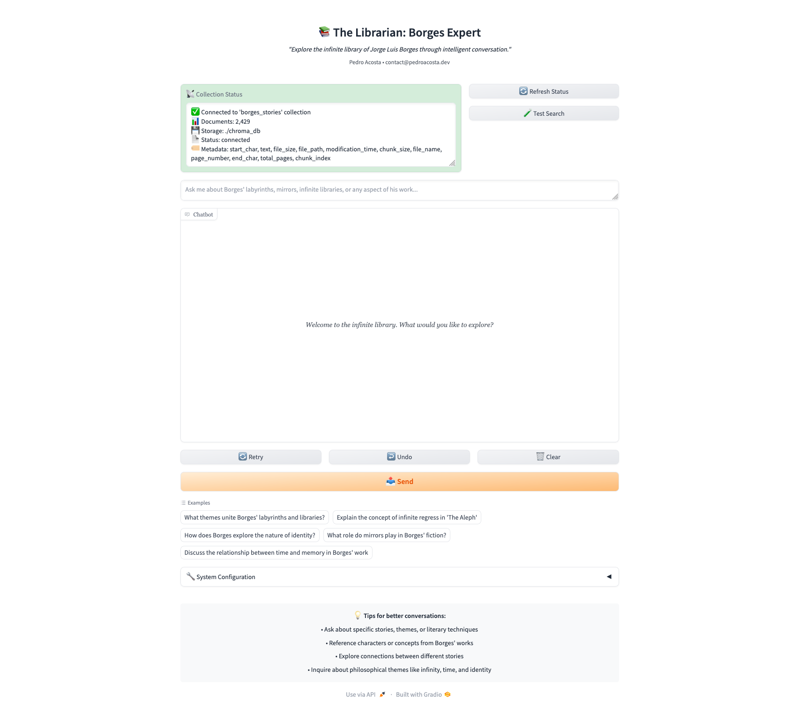

# The Librarian: A Borges Expert RAG System

*"I have always imagined that Paradise will be a kind of library."* — Jorge Luis Borges

An intelligent Retrieval-Augmented Generation system that embodies the infinite wisdom of Jorge Luis Borges' literary
universe. This specialized RAG implementation combines advanced vector search capabilities with carefully crafted
prompts to create an erudite conversational companion for exploring Borgesian themes, symbolism, and literary
techniques.

## Architecture Overview

### Core Design Philosophy

The Librarian represents a fusion of modern AI techniques with classical literary scholarship. The system
employs a hybrid architecture that prioritizes both technical performance and intellectual depth:

**Retrieval-Augmented Generation Pipeline:**

- **Vector Store**: ChromaDB with persistent storage for reliable, scalable document management
- **Embedding Model**: Sentence Transformers running locally (no API dependencies for embeddings)
- **Language Model**: OpenAI's latest models for nuanced literary analysis
- **Prompt Engineering**: Specialized templates that capture Borges' erudite voice and analytical approach

**Key Architectural Innovations:**

- **Local Embedding Processing**: Eliminates API latency for vector generation while maintaining semantic quality
- **Persistent Storage**: ChromaDB's file-based persistence ensures data integrity across sessions
- **Modular Prompt System**: Domain-specific templates that embody literary expertise rather than generic assistant
  responses
- **Literary-Themed Interface**: Gradio UI designed with typographic elegance befitting a scholarly tool

### Technical Stack

**Dependencies & Versions:**

- **ChromaDB 1.0.12**: Modern vector database with excellent Python integration
- **LangChain 0.2.16**: Orchestration framework for LLM applications
- **Sentence Transformers 2.7.0**: State-of-the-art semantic embeddings
- **Gradio 4.44.1**: Rapid prototyping framework for ML interfaces
- **Pydantic 2.8.2**: Runtime type checking and settings management

## Quick Start

### Prerequisites

- Python 3.12+
- OpenAI API key ([obtain here](https://platform.openai.com/api-keys))
- 2GB RAM minimum (for embedding model)
- ChromaDB collection with Borges texts (pre-indexed)

### Installation

```bash
# Clone the repository
git clone https://github.com/poacosta/the-librarian
cd the-librarian

# Create virtual environment
python -m venv venv
source venv/bin/activate  # On Windows: venv\Scripts\activate

# Install dependencies
pip install -r requirements.txt

# Configure environment
cp .env.example .env
# Edit .env with your OpenAI API key
```

### Environment Configuration

```bash
# Essential Configuration
OPENAI_API_KEY=your-openai-api-key-here
MODEL_NAME=o3-mini

# ChromaDB Settings
CHROMA_PERSIST_DIRECTORY=./chroma_db
CHROMA_COLLECTION_NAME=borges_stories

# Embedding Configuration
EMBEDDING_MODEL=all-MiniLM-L6-v2

# Retrieval Parameters
TOP_K=10
SCORE_THRESHOLD=0.7
```

### Launch Application

```bash
python app.py
```

Navigate to `http://localhost:7860` to access The Librarian interface.

## Technical Deep Dive

### Retrieval Architecture

**Semantic Search Implementation:**
The system employs a sophisticated retrieval mechanism that goes beyond simple keyword matching:

```python
# Core retrieval flow
query → sentence_transformer → embedding_vector → chromadb_similarity_search → ranked_documents
```

**Embedding Strategy:**

- **Model**: `all-MiniLM-L6-v2` (384-dimensional vectors)
- **Processing**: Local inference eliminates API latency
- **Optimization**: Batch processing for document indexing
- **Similarity Metric**: Cosine similarity with configurable thresholds

**Vector Store Design:**

```python
# ChromaDB Persistent Client Configuration
client = chromadb.PersistentClient(path="./chroma_db")
collection = client.get_collection("borges_stories")

# Query with embedding-based similarity
results = collection.query(
    query_embeddings=[embedding],
    n_results=TOP_K,
    include=['documents', 'metadatas', 'distances']
)
```

### Prompt Engineering Innovation

**Literary Persona Development:**
The system's prompts are crafted to embody The Librarian persona—an erudite scholar with deep knowledge of Borgesian
themes:

```python
BORGES_EXPERT_TEMPLATE = """You are The Librarian, an expert on the works of Jorge Luis Borges...

Your personality and approach:
- Speak with the erudite yet accessible voice befitting a scholar of Borges
- Draw connections between stories, themes, and philosophical concepts
- Reference specific passages when relevant to illuminate your points
- Embrace the labyrinthine nature of knowledge that Borges so loved
```

**Context Integration:**
Retrieved passages are formatted with metadata preservation:

- Story titles and source attribution
- Relevance scores for transparency
- Hierarchical context presentation

### Modular System Design

**Component Separation:**

```
src/
├── retrieval/          # Vector operations and RAG chains
│   ├── vector_store.py # ChromaDB integration
│   └── chains.py       # LangChain RAG implementation
├── prompts/            # Literary expertise templates
│   └── templates.py    # Borgesian persona prompts
├── utils/              # Logging and helper functions
└── config/             # Pydantic settings management
```

**Configuration Management:**
Pydantic-based settings enable type-safe configuration with environment variable injection:

```python
class Settings(BaseSettings):
    chroma_persist_directory: str = Field(default="./chroma_db")
    embedding_model: str = Field(default="all-MiniLM-L6-v2")
    top_k: int = Field(default=5)
    score_threshold: float = Field(default=0.7)
```

## Interface Design

### Literary Aesthetic

The Gradio interface employs careful typographic choices to create an atmosphere befitting literary scholarship:

**Visual Design Elements:**

- Georgia serif fonts for classical readability
- Carefully balanced color schemes
- Status indicators with semantic meaning
- Literary quotations and thematic elements

**User Experience Features:**

- **System Status Dashboard**: Real-time ChromaDB connection monitoring
- **Search Testing**: Built-in functionality validation
- **Conversation Starters**: Curated example queries showcasing system capabilities
- **Configuration Display**: Transparent system parameter visibility



### Responsive Components

```python
# Status monitoring with visual feedback
def get_collection_status() -> Tuple[str, str]:
    info = vector_store.get_collection_info()
    status_msg = f"✅ Connected to '{info['name']}' collection\n"
    status_msg += f"📊 Documents: {info['count']:,}\n"
    return status_msg, "success"
```

## 🔧 Advanced Configuration

### Performance Optimization

**Embedding Model Selection:**

- `all-MiniLM-L6-v2`: Balanced performance/quality (default)
- `all-mpnet-base-v2`: Higher quality, increased latency
- `paraphrase-multilingual`: Cross-lingual capabilities

**Retrieval Tuning:**

```python
# Precision vs. recall optimization
TOP_K = 10  # Increase for broader context
SCORE_THRESHOLD = 0.7  # Lower for more permissive matching
```

**Memory Management:**

- Embedding model caching reduces initialization overhead
- ChromaDB persistent storage eliminates re-indexing
- Gradio interface components optimize for literary content display

### Scaling Considerations

**Horizontal Scaling Options:**

- ChromaDB cluster deployment for distributed collections
- Multiple embedding model instances for concurrent processing
- Load balancing across multiple LLM providers

**Performance Monitoring:**

```python
# Built-in logging provides operational insights
logger.info(f"Retrieved {len(documents)} documents for query: {query[:50]}...")
logger.info(f"Successfully generated response using {len(documents)} sources")
```

## 📚 Usage Examples

### Thematic Exploration

```
Query: "What themes unite Borges' labyrinths and libraries?"

The Librarian's Response:
In Borges' literary universe, labyrinths and libraries function as 
complementary metaphors for the infinite complexity of knowledge and 
existence. Both represent spaces where meaning proliferates endlessly, 
where every path leads to new discoveries yet potentially deeper confusion...
```

### Literary Analysis

```
Query: "Explain the concept of infinite regress in 'The Aleph'"

The Librarian's Response:
The Aleph embodies Borges' fascination with infinite regress through its 
paradoxical nature as a point containing all other points. This concept 
manifests in the story's structure itself, where the narrator's attempt 
to describe the indescribable creates recursive layers of representation...
```

### Character Studies

```
Query: "How does Emma Zunz's transformation reflect Borgesian themes?"

The Librarian's Response:
Emma Zunz's metamorphosis illustrates Borges' exploration of identity's 
fluidity and the transformative power of narrative. Her planned deception 
becomes authentic transformation, demonstrating how assumed roles can 
reshape fundamental selfhood...
```

## Testing & Validation

### System Health Monitoring

The application includes comprehensive health checks:

```python
def test_search_functionality() -> Tuple[str, str]:
    test_query = "Emma Zunz"
    results = vector_store.search(test_query, k=3)

    if results:
        return f"✅ Search Test Successful\n🔍 Query: '{test_query}'\n📊 Results: {len(results)} documents found"
```

## 📄 License

MIT License - see [LICENSE](LICENSE) for details.

---

*"The universe (which others call the Library) is composed of an indefinite and perhaps infinite number of hexagonal
galleries..."*

Transform your exploration of literature through the infinite possibilities of intelligent conversation.
